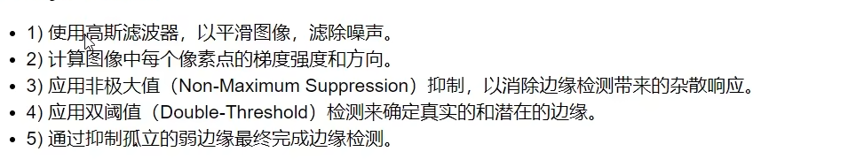

# deep_learning_demo
深度学习入门学习

## 安装paddle 过程
在anaconda下面，python3.8 安装gpu版本的paddle
https://www.paddlepaddle.org.cn/

python -m pip install paddlepaddle-gpu==2.4.2 -i https://pypi.tuna.tsinghua.edu.cn/simple

下面开始实验

## cifar_10数据集做分类任务
### 1、renet_18网络结构
利用paddle的高级API来创建Resnet网络模型结构


## opencv
### 图像sobel算子


$G_x$表示的是水平方向：右边减去左边

$G_y$是竖直方向：上边减去下边


白色减去黑色是整数，黑色减去白色是负数，opencv会截断负数为0，所以要去绝对值

```python
dst = cv2.convertScaleAbs( src [, alpha[, beta]] )
```

### 图像scharr算子


```python
dst = cv2.Scharr( src, ddepth, dx, dy[, scale[, delta[, borderType]]] )
```

参数说明：

ddepth:输出图像的深度，dx表示在x方向上的导数，dy表示在y方向上的导数。

scale:表示在计算导数时的缩放因子

delta:代表加在目标图像上的亮度。


### 图像laplacian算子


### canny边缘检测的流程



1.高斯滤波器


$$
H=\begin{bmatrix}
0.0924&0.1192&0.0924 \\
0.1192&0.1538&0.1192\\
0.0924&0.1192&0.0924
\end{bmatrix}
$$
2.梯度方向


3.非极大值抑制


双阈值检测


